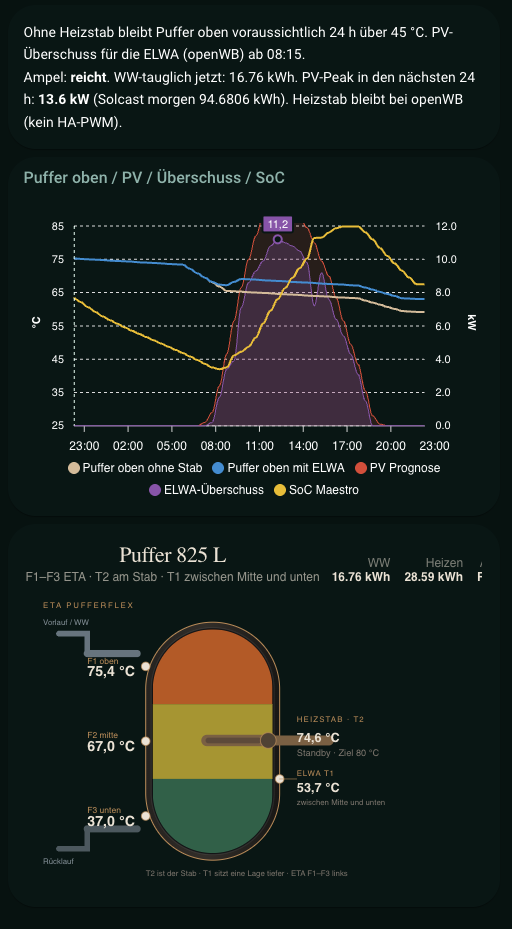

# HA Heating Strategy (Hybrid: heat pumps + buffer + pellet)

Home Assistant package for a **shoulder-season and winter strategy** that covers space heat with climate units and PV/buffer energy first, and only starts a pellet boiler (here: ETA) as backup.

This is a **reference install** from a real house, not plug-and-play for every setup. It fits if you have a similar mix: split or heat-pump climate in living spaces, a hydraulic bathroom/radiators, buffer tank with immersion heater, PV forecast, and a boiler you want to run rarely but then for a sensible duration.

## Idea in one line

Climate first, buffer/immersion for DHW and residual heat, heating circuit only where needed, pellet boiler rarely and on purpose, driven by clear modes, setpoints, and a one-minute tick.

## Priorities

1. Keep living spaces warm with climate (`heat`) while energy balance and comfort allow it
2. DHW / buffer via immersion heater (ELWA or similar), use residual heat
3. Hydraulic rooms (bath, maybe more) via tado / heating circuit, avoid boiler starts when possible
4. ETA / pellet only when buffer or comfort is at risk, with failsafe and without constant short-cycling

## What is in this repo

| Path | Contents |
|------|----------|
| `packages/heizung_helpers.yaml` | `input_*`, timers (setpoints, switches, away, window locks) |
| `packages/heizung_templates.yaml` | Setpoint sensors, away, window raw/confirmed, buffer forecast, climate idle |
| `packages/heizung_scripts.yaml` | `heizung_tick`, apply climate/tado, valves, failsafe |
| `packages/heizung_automations.yaml` | Minute tick, window debounce, manual override, cold confirmation |
| `packages/schimmel_helpers.yaml` | Switches, target °C, and time window for mold-heat boost |
| `packages/schimmel_templates.yaml` | Local risk sensors, heat-active flags, ventilation advice |
| `dashboards/heizung.yaml` | Lovelace backup of the control UI |
| `dashboards/beispiel-puffer-prognose.png` | Buffer/forecast screenshot |
| `ARCHITECTURE.md` | Flow and design choices |
| `GLOSSARY.md` | English meanings for `Aus` / `Übergang` / `Winter`, rooms, people |
| `ENTITY_MAP.md` | Hardware entities you must remap |
| `INSTALL.md` | How to load as packages |

Entity IDs for climate, windows, ETA, PV, and so on come from the reference house. Person and bedroom labels use **aliases** (`schlafen_a/b/c`, `person.person_a/b/c`). Map them before use (see `ENTITY_MAP.md`).

Mode options stay German in YAML: **`Aus` = Off**, **`Übergang` = shoulder season / transition**, **`Winter` = winter**. Full word list: `GLOSSARY.md`.

Display names inside the YAML are still partly German (reference UI). Docs and the community write-up are English. Entity ID prefixes stay `heizung_*` / `schimmel_*`.

## Dashboard example

Reference UI from the live install (YAML backup: `dashboards/heizung.yaml`).

### Buffer and forecast

Buffer headroom, PV/ELWA surplus, and tank layer temperatures.

## Typical features

- Modes `Aus` (Off) / `Übergang` (shoulder season) / `Winter` with central setpoint helpers
- Schedules per zone (living, office, bedrooms A/B/C, bath, playroom)
- Away setback for house vs office (no tado geofencing required)
- Timed climate manual override for non-heat modes and heat setpoints that differ from strategy
- Windows: open debounce, lockout after close
- ETA failsafe when mode is off
- Buffer forecast / PV forecast as decision inputs
- Mold: local risk (dew-point margin), ventilate vs heat, optional daytime climate boost

## Prerequisites (reference)

Roughly:

- Home Assistant with YAML packages
- Climate devices as `climate.*` (Mitsubishi / Daikin / Faikin or similar)
- optional tado or other valves for hydraulic rooms
- optional pellet/boiler with switchable entities (boiler, circuit, force charge)
- optional buffer sensors and immersion heater
- optional PV or grid-import forecast (Solcast, Maestro, …)
- optional `person` entities for away
- for mold: room temperature + humidity (or tado risk sensors) and `weather.*` with dew point

HACS cards may be needed for the dashboard; the logic runs without it.

## Status

Production reference, in use for the heating season and still evolving. APIs and entity names will differ in your install. The **strategy** is the reusable part, not the exact IDs.

## License

MIT. See `LICENSE`. Use at your own risk. Bad wiring in heating automations can waste fuel or damage comfort. Start with auto flags off and verify setpoints before enabling control.
